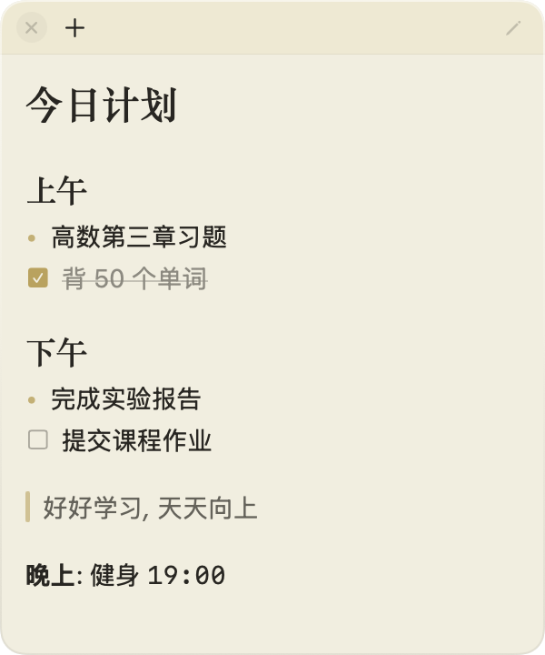
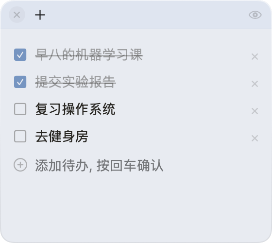
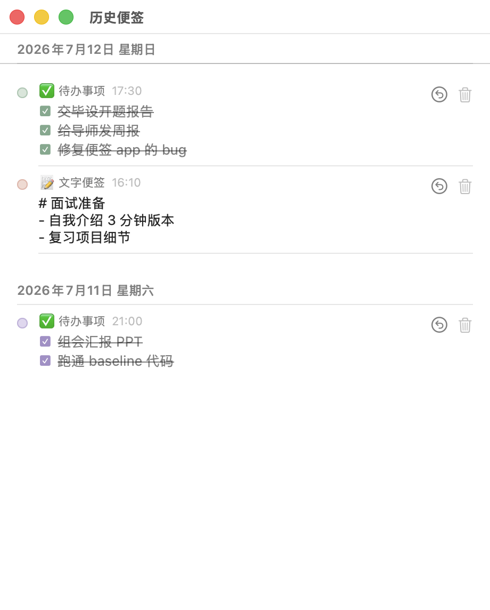

# oncenotes 📝

[中文](README.md) | **English**

A lightweight, beautiful sticky notes app for macOS. Built with native Swift + SwiftUI, zero third-party dependencies — the compiled binary is only a few hundred KB.

## Screenshots

<table>
  <tr>
    <td align="center"><b>📝 Text Notes</b><br><sub>Markdown rendering · Glassmorphism</sub></td>
    <td align="center"><b>✅ Todo Notes</b><br><sub>Check to strike through · Week calendar</sub></td>
  </tr>
  <tr>
    <td></td>
    <td></td>
  </tr>
</table>

<b>🕰 History</b> — deleted notes are archived by date, so you can look back at what you did each day and restore any note with one click<br>


<br><b>📏 Collapsed Notes + Edge Snapping</b> — collapse a note into a single title bar (todo notes show completion progress);
drag it near the left/right screen edge to snap flush, with the edge-side corners "cut flat"; release to settle smoothly with trackpad haptic feedback<br>
<br>
<br>


## Features

- **Three note types**
  - 📝 **Text notes**: Markdown support (headings, lists, todo syntax, quotes, bold/italic/inline code, dividers), one-click toggle between edit and preview
  - ✅ **Todo notes**: a week-calendar filter (7 date cells, Sunday first on the left); each todo can be assigned to a day (unscheduled items collect in an "Unscheduled" section); tapping the "M月" label in the calendar row toggles to show all unscheduled items; new todos default to the selected day and sit at the top; edited items re-date to today on blur; Enter inserts a new line below; creating a fresh todo note automatically absorbs unfinished items from other notes
  - 📅 **Calendar**: a month view with offline lunar dates and holidays — pin it to the desktop as a translucent glass calendar card; right-click a day cell to add a mark, which auto-generates a todo for that day
- **Three window modes** (set per note)
  - 📌 Always on top — floats above every other window
  - 🪟 Normal window — behaves like a regular app
  - 🖥 Pinned to desktop — sinks to the desktop layer, sticking to the wallpaper like a widget without blocking anything
- **Opacity slider** (all three note types): 30%–100% — dial it down and the card looks like a pane of glass
- **History**: deleted notes are automatically archived by date; browse day by day and restore with one click; scheduled todos inside archived notes are matched back to their dates (by item text) when you create a new todo note
- **Collapsed notes**: collapse a note into a single title bar — the title comes from the first line and is never truncated; todo notes show completion progress (e.g. `2/4`); collapsed state persists across restarts
- **Edge snapping**: drag a collapsed bar near the left/right screen edge to snap flush — the edge-side corners turn square (as if "cut off" by the screen), with trackpad haptic feedback; release to settle smoothly
- **Checkable preview**: in text-note preview mode, the checkboxes rendered from `- [ ]` are directly clickable, and the source text stays in sync
- **Highlighter**: drag across text to mark it just like a real highlighter — works in both text and todo notes; backspace erases character by character, the highlight color matches each note's theme, and highlights persist, follow your edits, and stay visible in preview mode
- **AI integration (MCP)**: built-in MCP server so AI assistants like Codex / Claude can create, edit, delete, move, collapse, and restore notes directly (see below)
- **Three soft colors**: Morandi-style lemon yellow / peach pink / sky blue
- **Glassmorphism design**: frosted translucent background, gradient glass border, serif headings
- **Auto save**: writes to disk 1 second after you stop typing; position, size, color, and mode are all remembered
- **Launch at login**: one-click toggle in the menu bar
- **Unobtrusive**: no Dock icon — lives quietly in the menu bar; borderless rounded-card design

## Install

Requires macOS 14+ and Xcode Command Line Tools (`xcode-select --install`).

```bash
git clone https://github.com/isfamily/oncenotes.git
cd oncenotes
./build.sh
open "/Applications/一次便签.app"
```

`build.sh` compiles, packages the `.app`, signs it (ad-hoc), and installs it to `/Applications`.

## Usage

| Action | How |
|---|---|
| New note | Menu bar 📝 icon, or **+** in a note's top bar (both let you pick the type) |
| Move | Drag anywhere on the note |
| Resize | Drag the note's edges |
| Change color / window mode | Hover over the note's top bar |
| Opacity | Slider in the top bar (30%–100%), available on all note types |
| Edit / preview | ✏️ / 👁 button in the top bar |
| Collapse / expand | Click the title bar |
| Edge snap | Drag a collapsed bar near the left/right screen edge (snaps within 16pt, drag away to release) |
| Check off todos | Click the checkbox in a todo note; clicking `- [ ]` boxes in text-note preview works too |
| Schedule todos | Tap the calendar button at the end of a line to pick a day; unscheduled items live in the "Unscheduled" section; tap the "M月" label to view all unscheduled items |
| Delete a single todo | Right-click the line → "Delete this item" |
| Highlighter | Top-bar highlighter button or `⌘⇧H` to enter the mode: drag to paint, click to place the caret, backspace to erase, Esc to exit; the right-click menu erases the selection or clears all highlights |
| Delete note | Right-click the note → "Delete this note" (archived into history, recoverable) |
| View / restore history | Menu bar → "History" |
| Summon all notes | Click the app icon |

### Markdown cheat sheet (text notes)

```markdown
# H1   ## H2   ### H3
- bullet list
- [ ] todo   - [x] done
> quote
**bold** *italic* `code`
---
```

## AI Integration (MCP)

The project ships a zero-dependency [MCP](https://modelcontextprotocol.io/) server (`mcp/stickynotes_mcp.py`, runs on the system Python) that exposes sticky-note capabilities to any MCP-compatible AI client (Codex, Claude Desktop, Claude Code, etc.). Once configured, just tell your AI "put tomorrow's study plan on a sticky note" and it appears on screen.

**Available tools:**

| Tool | Description |
|---|---|
| `create_note` | Create a note (full parameters: type / color / window mode / collapsed, plus words to highlight or bold) |
| `update_note` | Change content, color, window mode, preview, or collapsed state by id — and reset highlight/bold marks |
| `delete_note` | Delete a note (non-empty content is archived automatically) |
| `move_resize_note` | Move or resize a note window |
| `list_notes` / `list_history` | Read active notes and history, including ids needed by other tools |
| `restore_note` | Restore an archived item as a note |
| `delete_history_item` | Permanently delete one history item |
| `show_all_notes` / `show_history` | Bring notes forward or open the history window |

Marks are specified by text, not offsets: `highlight: ["key point"]` paints every occurrence of "key point" in the note, and `bold` works the same way; pass `[]` to clear. When `update_note` only replaces the text, existing highlights and bold runs are re-anchored by the words they covered, so an AI rewording one sentence doesn't wipe them all.

Everyday changes are sent to the running app as granular commands, so the MCP server neither rewrites the JSON database nor restarts the app. The bulk migration/recovery tools `admin_export_data` and `admin_overwrite_data` are hidden by default. Set `STICKYNOTES_ENABLE_ADMIN_TOOLS=1` for the MCP process to expose them; an overwrite also requires an exact data revision and explicit confirmation.

**Setup (Codex desktop)** — append to `~/.codex/config.toml`:

```toml
[mcp_servers.stickynotes]
command = "python3"
args = ["/path/to/oncenotes/mcp/stickynotes_mcp.py"]
```

**Setup (Claude Code):**

```bash
claude mcp add stickynotes -- python3 /path/to/oncenotes/mcp/stickynotes_mcp.py
```

Restart the client and the AI will see the tools above.

## Data Storage

Notes are saved to `~/Library/Application Support/StickyNotes/notes.json` as plain JSON, easy to back up and migrate.

## Project Structure

```
Sources/StickyNotes/
├── main.swift          # Entry point, NSApplication startup, hidden Edit menu (keyboard shortcuts)
├── AppDelegate.swift   # Menu bar, note window management, type picker, URL interface
├── Note.swift          # Data model + JSON persistence + todo item I/O + history archiving
├── NoteView.swift      # SwiftUI views: note view, todo list, Markdown rendering, capsule bar
├── HistoryView.swift   # History window: grouped by date, restore, permanent delete
└── NoteWindow.swift    # Borderless window, three layer modes, collapse & edge snapping
mcp/
└── stickynotes_mcp.py  # MCP server: entry point for AI clients to control notes
```

## License

[MIT](LICENSE)
